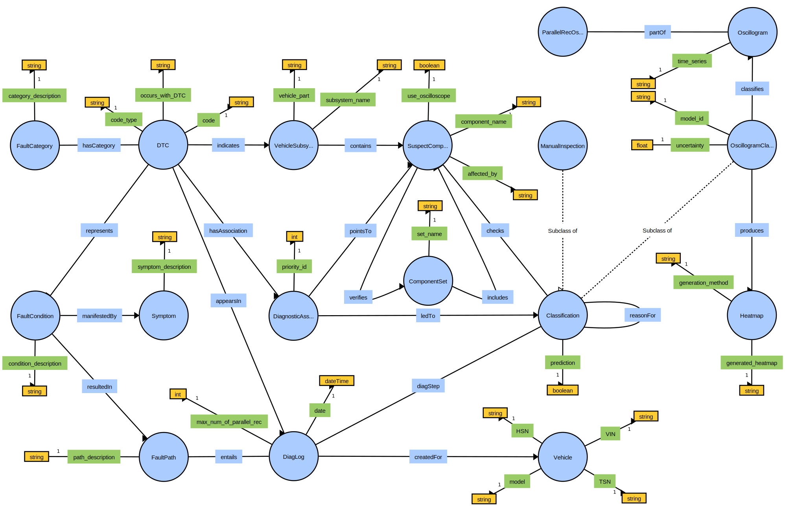

# OBD Ontology


[](https://opensource.org/licenses/MIT)

> Ontology for capturing knowledge about automotive [on-board diagnostics](https://en.wikipedia.org/wiki/On-board_diagnostics) (OBD), particularly [diagnostic trouble codes](https://en.wikipedia.org/wiki/OBD-II_PIDs) (DTCs). The objective is to build up a knowledge graph based on this ontology by populating it with large amounts of instance data (cf. `knowledge_base/live_kg_backups/`) as well as functionalities for knowledge acquisition, enhancement and retrieval.



## Three Levels of Abstraction

- **raw ontology definition**: no instance data, just concepts with properties and relations (`knowledge_base/raw_obd_ontology.owl`)
- **vehicle-agnostic expert knowledge** regarding on-board diagnostics (OBD, [ISO 15031-6](https://www.iso.org/standard/66369.html))
- **vehicle-specific diagnosis knowledge** automatically generated based on OBD logs read in workshops and acquired as part of the diagnostic process (recorded sensor data, interpretations, etc., cf. [vehicle_diag_smach ](https://github.com/tbohne/vehicle_diag_smach))

All three levels combined constitute the knowledge graph (`knowledge_base/live_kg_backups/`).

## Dependencies

- for Python requirements, cf. `requirements.txt`
- [**Apache Jena Fuseki**](https://jena.apache.org/documentation/fuseki2/): SPARQL server hosting / maintaining the knowledge graph

## Installation
```
$ git clone https://github.com/tbohne/obd_ontology.git
$ cd obd_ontology/
$ pip install .
```

## Usage

**Run server from *Apache Jena Fuseki* root directory (runs at `localhost:3030`):**
```
$ ./fuseki-server
```

**<u>Launch knowledge graph from `.owl` / `.ttl` file:</u>**
- navigate to `localhost:3030`
- `manage` -> `new dataset`
    - Dataset name: `OBD`
    - Dataset type: `Persistent (TDB2) – dataset will persist across Fuseki restarts`
- `create dataset`
- `add data` -> `select files`
    - select knowledge graph file, e.g., `knowledge_base/test_kg.ttl`
    - `upload now`

Now the knowledge graph is hosted on the *Fuseki* server and can be queried, extended or updated via the SPARQL endpoints `/OBD/sparql`, `/OBD/data` and `/OBD/update` respectively.

**<u>Backup knowledge graph:</u>**
- `manage` -> `backup`

Creates a backup in `fuseki_root/run/backups/`.

The `.nq.gz` file should be extracted and the resulting `data` should be renamed to `data.ttl` so that it can be interpreted directly, e.g., when launching it on the server (see above).

## Expert Knowledge Acquisition Web Interface

The `ExpertKnowledgeEnhancer` can be used to augment the knowledge graph hosted by the *Fuseki* server with **vehicle-agnostic expert knowledge**. In particular, it generates semantic facts based on the information entered through a web interface and connects these facts in a meaningful way to what is already available in the knowledge graph, i.e., it serves as a backend for the knowledge acquisition component. Finally, all generated facts are concatenated and sent to the `ConnectionController`. Quite a number of semantic facts have to be generated when an expert enters few information. There are front- and back-end functionalities, i.e., expert knowledge input via the web interface and corresponding generation of semantic facts in the backend, for each concept. All of this is accompanied by a series of input validation mechanisms. This way, a simple knowledge graph extension for the expert goes hand in hand with an automatic proper “wiring” of semantic facts in the background.

Run server from *Apache Jena Fuseki* root directory (runs at `localhost:3030`):
```
$ ./fuseki-server
```
Run knowledge acquisition front-end (`Flask` server - runs at `localhost:5000`):
```
$ python obd_ontology/app.py
```

## Enhancement of Vehicle-Specific Diagnosis Knowledge

The `OntologyInstanceGenerator`, on the other hand, enhances the knowledge graph hosted by the *Fuseki* server with **diagnosis-specific instance data**, i.e., it connects the on-board diagnosis data recorded in a particular vehicle, as well as sensor readings, classifications, etc. generated during the diagnostic process, with corresponding background knowledge stored in the knowledge graph, e.g.:
```python
instance_gen = OntologyInstanceGenerator(".", local_kb=False)
instance_gen.extend_knowledge_graph_with_vehicle_data(
    "Mazda 3", "123", "456", "ID2342713"
)
classification_instances = [
    instance_gen.extend_knowledge_graph_with_oscillogram_classification(
        True, "diag_association_0", "C_A", 0.45, "test_model_id", "osci_id", "heatmap_id"
    ),
    instance_gen.extend_knowledge_graph_with_oscillogram_classification(
        True, "oscillogram_classification_0", "C_B", 0.85, "test_model_id", "osci_id", "heatmap_id"
    ),
    instance_gen.extend_knowledge_graph_with_manual_inspection(
        False, "oscillogram_classification_1", "C_C"
    )
]
diag_log_uuid = instance_gen.extend_knowledge_graph_with_diag_log(
    "23.08.2023", 4, ["P2563"], ["fault_path_id"], classification_instances, "vehicle_ID2342713"
)
```
This is used as part of [vehicle_diag_smach](https://github.com/tbohne/vehicle_diag_smach). All kinds of relevant diagnostic information are gathered and linked so that previously unknown correlations can be discovered by deploying the system in practice.

## Knowledge Graph Query Tool

The `KnowledgeGraphQueryTool` provides a library of numerous predefined SPARQL queries and response processing to access information stored in the knowledge graph that is used in the diagnostic process, e.g.:
```python
qt = KnowledgeGraphQueryTool(local_kb=False)
qt.print_res(qt.query_all_dtc_instances())
dtc = "P2563"
qt.print_res(qt.query_fault_condition_by_dtc(dtc))
qt.print_res(qt.query_symptoms_by_dtc(dtc))
qt.print_res(qt.query_fault_cat_by_dtc(dtc))
qt.print_res(qt.query_suspect_components_by_dtc(dtc))
qt.print_res(qt.query_dtc_occurring_with_the_specified_dtc(dtc))
qt.print_res(qt.query_vehicle_by_dtc(dtc))
...
suspect_comp_name = "C_D"
qt.print_res(qt.query_oscilloscope_usage_by_suspect_component(suspect_comp_name))
qt.print_res(qt.query_affected_by_relations_by_suspect_component(suspect_comp_name))
...
vin = "ID2342713"
qt.print_res(qt.query_vehicle_instance_by_vin(vin)
...
```
This is also used as part of [vehicle_diag_smach](https://github.com/tbohne/vehicle_diag_smach), which essentially guides the diagnostic process based on knowledge graph queries (symbolic reasoning).

## Knowledge Snapshot

The idea of the knowledge snapshot is to output the knowledge currently stored in the knowledge graph on a concept-by-concept basis. This is useful, for instance, to compare different states via `diff`. As anticipated, there are two themes to the ontology - expert knowledge and diagnostic knowledge, for each of which there is a corresponding knowledge snapshot.
```
$ python obd_ontology/knowledge_snapshot.py [--perspective {expert | diag}]
```

## Related Publications

TBD.
