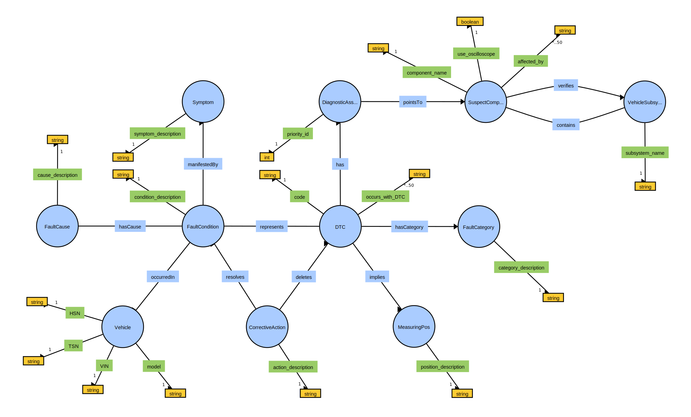
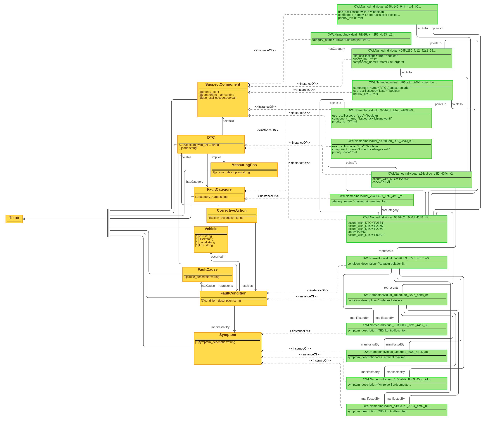

# OBD Ontology

Ontology for capturing knowledge about [on-board diagnostics](https://en.wikipedia.org/wiki/On-board_diagnostics) (OBD), particularly [diagnostic trouble codes](https://en.wikipedia.org/wiki/OBD-II_PIDs) (DTCs). The objective is to build up a knowledge graph based on this ontology by populating it with large amounts of instance data (cf. `knowledge_base/obd_knowledge_graph.owl`).



## Three Levels of Abstraction

- **raw ontology definition**: no instance data, just concepts and relations (`knowledge_base/raw_obd_ontology.owl`)
- **vehicle-agnostic knowledge**: OBD knowledge (codes, symptoms, categories, etc.), no specific vehicle info
- **vehicle-specific knowledge**: instance data for one specific vehicle (to be generated automatically based on read OBD data, cf. [
vehicle_diag_smach ](https://github.com/tbohne/vehicle_diag_smach))

All three levels combined constitute the knowledge graph (`knowledge_base/obd_knowledge_graph.owl`).

## Sample Knowledge Graph



## Dependencies

- [**rdflib**](https://rdflib.readthedocs.io/en/stable/): pure Python package for working with RDF
- [**owlready2**](https://pypi.org/project/Owlready2/): package for ontology-oriented programming in Python
- [**requests**](https://pypi.org/project/requests/): HTTP lib for Python
- [**dtc_parser**](https://github.com/tbohne/dtc_parser): parser for diagnostic trouble codes (DTCs) used by vehicle onboard diagnosis (OBD)
- [**Apache Jena Fuseki**](https://jena.apache.org/documentation/fuseki2/): SPARQL server hosting / maintaining the knowledge graph
- [**termcolor**](https://pypi.org/project/termcolor/): ANSI color formatting for output in terminal

## Installation
```
$ git clone https://github.com/tbohne/obd_ontology.git
$ cd obd_ontology/
$ pip install .
```

## Usage

**Run server from *Apache Jena Fuseki* root directory (runs at `localhost:3030`):**
```
$ ./fuseki-server
```

**<u>Launch knowledge graph from `.owl` / `.ttl` file:</u>**
- navigate to `localhost:3030`
- `manage` -> `new dataset`
    - Dataset name: `OBD`
    - Dataset type: `Persistent (TDB2) – dataset will persist across Fuseki restarts`
- `create dataset`
- `add data` -> `select files`
    - select knowledge graph file, e.g., `demo_knowledge_graph.ttl`
    - `upload now`

Now the knowledge graph is hosted on the *Fuseki* server and can be queried or extended via the SPARQL endpoint `/OBD/sparql` and `/OBD/data`, respectively.

**<u>Backup knowledge graph:</u>**
- `manage` -> `backup`

Creates a backup in `fuseki_root/run/backups/`.

The `.nq.gz` file should be extracted and the resulting `data` should be renamed to `data.ttl` so that it can be interpreted directly, e.g., when launching it on the server (see above).

**<u>Extend knowledge graph:</u>**

The `ExpertKnowledgeEnhancer` can be used to extend the knowledge graph hosted by the *Fuseki* server with **vehicle-agnostic OBD knowledge** (codes, symptoms, etc.) provided in the form of `templates/*.txt`, e.g.:
```python
expert_knowledge_enhancer = ExpertKnowledgeEnhancer("dtc_expert_template.txt")
expert_knowledge_enhancer.extend_knowledge_graph()
```
The `OntologyInstanceGenerator` enhances the knowledge graph hosted by the *Fuseki* server with **vehicle-specific instance data**, i.e., connects the on-board diagnosis data recorded in a particular car with corresponding background knowledge stored in the knowledge graph, e.g.:
```python
instance_gen = OntologyInstanceGenerator(".", local_kb=False)
instance_gen.extend_knowledge_graph("Mazda 3", "847984", "45539", "1234567890ABCDEFGHIJKLMNOPQRSTUVWXYZ", "P2563")
```

**<u>Query knowledge graph:</u>**

The `KnowledgeGraphQueryTool` provides a library of predefined queries for accessing useful information stored in the knowledge graph, e.g.:

```python
qt = KnowledgeGraphQueryTool(local_kb=False)
qt.print_res(qt.query_all_dtc_instances())
dtc = "P2563"
qt.print_res(qt.query_fault_condition_by_dtc(dtc))
qt.print_res(qt.query_symptoms_by_dtc(dtc))
qt.print_res(qt.query_fault_cat_by_dtc(dtc))
qt.print_res(qt.query_suspect_components_by_dtc(dtc))
qt.print_res(qt.query_dtc_occurring_with_the_specified_dtc(dtc))
qt.print_res(qt.query_vehicle_by_dtc(dtc))
...
```

**<u>Expert knowledge acquisition front-end (web interface)</u>**

The extension of the knowledge graph with new expert knowledge can also be carried out via a web interface instead of the local templates described above.

Run server from *Apache Jena Fuseki* root directory (runs at `localhost:3030`):
```
$ ./fuseki-server
```
Run knowledge acquisition front-end (`Flask` server - runs at `localhost:5000`):
```
$ python obd_ontology/app.py
```

## Interpretation of non-obvious aspects modeled in the ontology

- `use_oscilloscope`: `true` means that it is generally possible to diagnose faults on this component using an oscilloscope
- `priority_id`: important because we suggest the components to be checked in a certain order, starting with the lowest ID, then ascending
- it's also essential to note that `Symptom`s associated with a `FaultCondition` are always optional - they do not have to be present, it is only possible for them to be present
