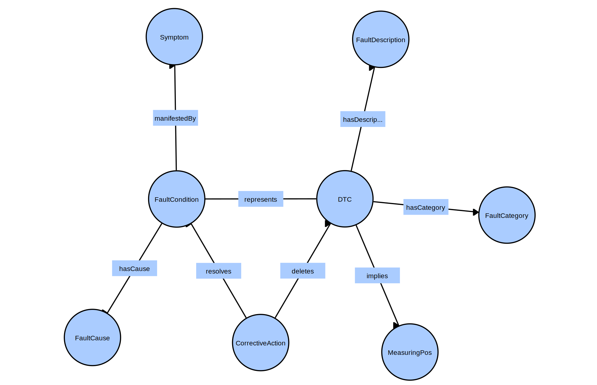

# OBDOntology

Ontology for capturing knowledge about on-board diagnosis (DTCs).

## Dependencies

- [**rdflib**](https://rdflib.readthedocs.io/en/stable/): pure Python package for working with RDF
