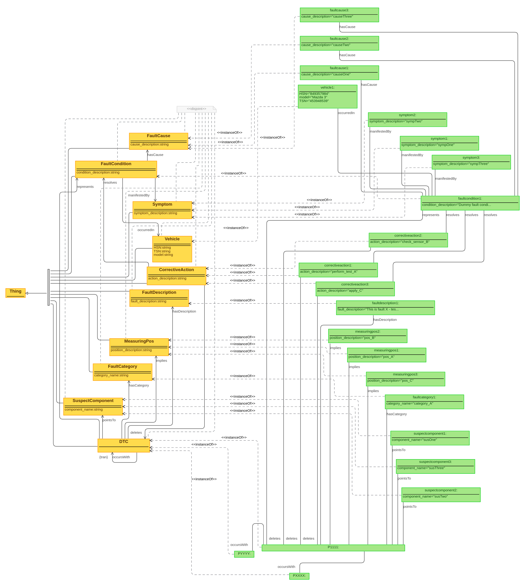

# OBDOntology

Ontology for capturing knowledge about [on-board diagnostics](https://en.wikipedia.org/wiki/On-board_diagnostics) (OBD), particularly [diagnostic trouble codes](https://en.wikipedia.org/wiki/OBD-II_PIDs) (DTCs). The objective is to build up a knowledge graph based on this ontology by populating it with large amounts of instance data (cf. `obd_knowledge_graph.owl`). Additionally, the `KnowledgeGraphQueryTool` provides a library of predefined queries for accessing useful instance information and the `OntologyInstanceGenerator` provides functionality for enhancing the knowledge graph with vehicle-specific instance data.

## Three Levels of Abstraction

- **raw ontology definition**: no instance data, just concepts and relations (`raw_obd_ontology.owl`)
- **vehicle-agnostic knowledge**: OBD knowledge (codes, symptoms, categories, etc.), no specific vehicle info
- **vehicle-specific knowledge**: instance data for one specific vehicle (to be generated automatically based on read OBD data, cf. [
vehicle_diag_smach ](https://github.com/tbohne/vehicle_diag_smach))

All three levels combined constitute the knowledge graph (`obd_knowledge_graph.owl`).

## Sample Instance

## Dependencies

- [**rdflib**](https://rdflib.readthedocs.io/en/stable/): pure Python package for working with RDF

## Interpretation of non-obvious aspects modeled in the ontology

- `use_oscilloscope`: `true` means that it is generally possible to diagnose faults on this component using an oscilloscope
- `priority_id`: important because we suggest the components to be checked in a certain order, starting with the lowest ID, then ascending
- it's also essential to note that `Symptom`s associated with a `FaultCondition` are always optional - they do not have to be present, it is only possible for them to be present
