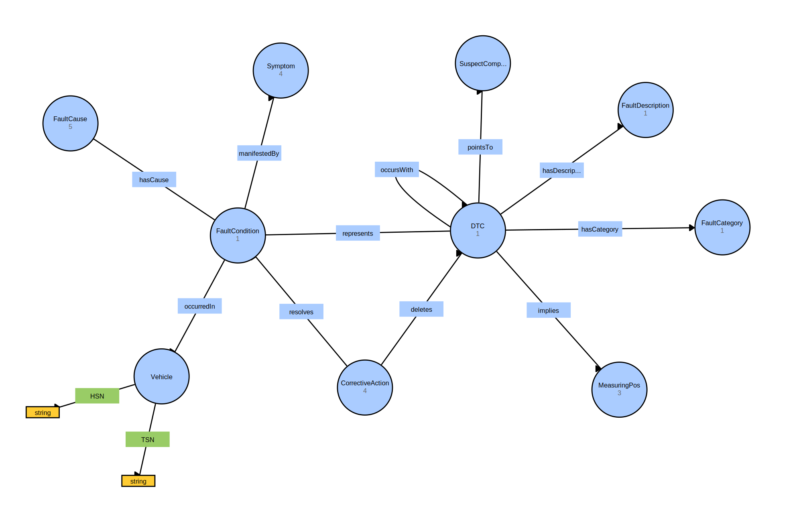

# OBDOntology

Ontology for capturing knowledge about [on-board diagnostics](https://en.wikipedia.org/wiki/On-board_diagnostics) (OBD), particularly [diagnostic trouble codes](https://en.wikipedia.org/wiki/OBD-II_PIDs) (DTCs). Additionally, the `OntologyQueryTool` provides a library of predefined queries for accessing instance information.

## Dependencies

- [**rdflib**](https://rdflib.readthedocs.io/en/stable/): pure Python package for working with RDF
