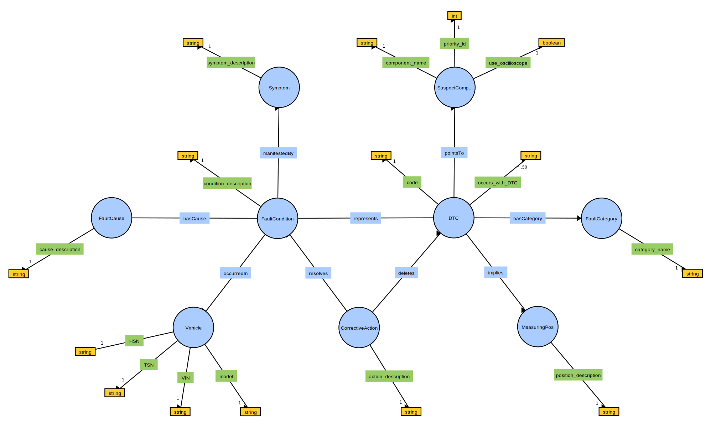

# OBDOntology

Ontology for capturing knowledge about [on-board diagnostics](https://en.wikipedia.org/wiki/On-board_diagnostics) (OBD), particularly [diagnostic trouble codes](https://en.wikipedia.org/wiki/OBD-II_PIDs) (DTCs). The objective is to build up a knowledge graph based on this ontology by populating it with large amounts of instance data (cf. `knowledge_base/obd_knowledge_graph.owl`). Additionally, the `KnowledgeGraphQueryTool` provides a library of predefined queries for accessing useful instance information and the `OntologyInstanceGenerator` provides functionality for enhancing the knowledge graph with vehicle-specific instance data recorded in car workshops.



## Three Levels of Abstraction

- **raw ontology definition**: no instance data, just concepts and relations (`knowledge_base/raw_obd_ontology.owl`)
- **vehicle-agnostic knowledge**: OBD knowledge (codes, symptoms, categories, etc.), no specific vehicle info
- **vehicle-specific knowledge**: instance data for one specific vehicle (to be generated automatically based on read OBD data, cf. [
vehicle_diag_smach ](https://github.com/tbohne/vehicle_diag_smach))

All three levels combined constitute the knowledge graph (`knowledge_base/obd_knowledge_graph.owl`).

## Sample Knowledge Graph


## Dependencies

- [**rdflib**](https://rdflib.readthedocs.io/en/stable/): pure Python package for working with RDF
- [**owlready2**](https://pypi.org/project/Owlready2/): package for ontology-oriented programming in Python
- [**requests**](https://pypi.org/project/requests/): HTTP lib for Python
- [**dtc_parser**](https://github.com/tbohne/dtc_parser): parser for diagnostic trouble codes (DTCs) used by vehicle onboard diagnosis (OBD)
- [**Apache Jena Fuseki**](https://jena.apache.org/documentation/fuseki2/): SPARQL server hosting / maintaining the knowledge graph

## Usage

**Run server from Apache Jena Fuseki root directory (runs at `localhost:3030`):**
```
$ ./fuseki-server
```

**Launch knowledge graph from `.owl` / `.ttl` file:**
- navigate to `localhost:3030`
- `manage` -> `new dataset`
    - Dataset name: `OBD`
    - Dataset type: `Persistent (TDB2) – dataset will persist across Fuseki restarts`
- `create dataset`
- `add data` -> `select files`
    - select knowledge graph file, e.g., `obd_knowledge_graph.owl`
    - `upload now`

Now the knowledge graph is hosted on the Fuseki server and can be queried / extended via the SPARQL endpoint `/OBD/sparql`.

**Backup knowledge graph:**
- `manage` -> `backup`

Creates a backup in `fuseki_root/run/backups/`.

The `.nq.gz` file should be extracted and the resulting `data` should be renamed to `data.ttl` so that it can be interpreted directly, e.g., when launching it on the server (see above).

## Interpretation of non-obvious aspects modeled in the ontology

- `use_oscilloscope`: `true` means that it is generally possible to diagnose faults on this component using an oscilloscope
- `priority_id`: important because we suggest the components to be checked in a certain order, starting with the lowest ID, then ascending
- it's also essential to note that `Symptom`s associated with a `FaultCondition` are always optional - they do not have to be present, it is only possible for them to be present
